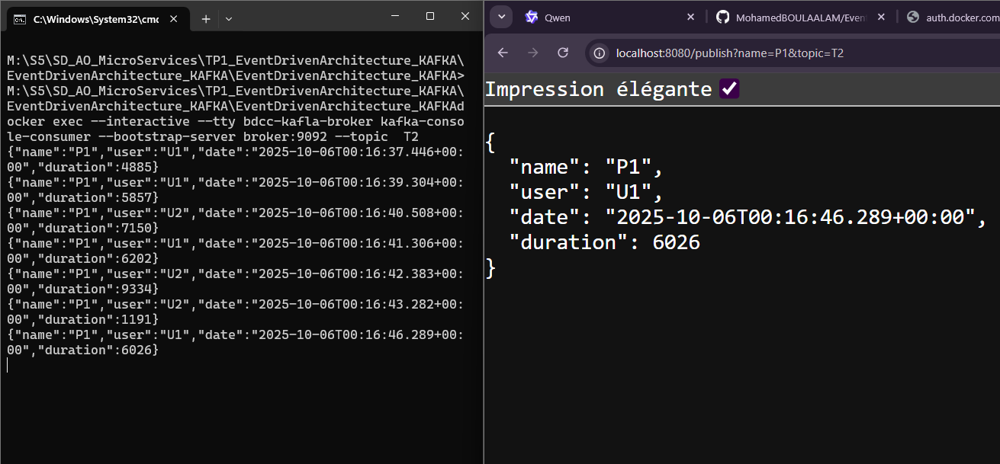

Le compte rendu de **l’Activité Pratique N°1** du module **Systèmes Parallèles et Distribués**, basée sur **l’architecture orientée événements (Event-Driven Architecture)** avec **Apache Kafka** et **Spring Cloud Streams**.

---

## **1. Installation et test manuel de Kafka (sans Docker)**

### Étapes :
1. **Télécharger Kafka**  
   Rendez-vous sur [https://kafka.apache.org/downloads](https://kafka.apache.org/downloads)  
   Téléchargez la dernière version binaire (ex: `kafka_2.13-3.7.0.tgz`).

2. **Extraire l’archive**
   ```bash
   tar -xzf kafka_2.13-3.7.0.tgz
   cd kafka_2.13-3.7.0
   ```

3. **Démarrer ZooKeeper** *(obligatoire pour les versions < 3.3)*
   ```bash
   bin/zookeeper-server-start.sh config/zookeeper.properties
   ```

4. **Démarrer le serveur Kafka**
   ```bash
   bin/kafka-server-start.sh config/server.properties
   ```

5. **Créer un topic**
   ```bash
   bin/kafka-topics.sh --create --topic test-topic --bootstrap-server localhost:9092 --partitions 1 --replication-factor 1
   ```

6. **Tester avec le producteur**
   ```bash
   bin/kafka-console-producer.sh --topic test-topic --bootstrap-server localhost:9092
   ```
   Tapez quelques messages.

7. **Tester avec le consommateur**
   ```bash
   bin/kafka-console-consumer.sh --topic test-topic --from-beginning --bootstrap-server localhost:9092
   ```

> L'affichage des messages que vous avez saisis dans le producteur.

---

## **2. Utilisation de Kafka avec Docker (via Confluent CLI ou docker-compose)**

### Option recommandée : **docker-compose.yml**

Créez un fichier `docker-compose.yml` :

```yaml
version: '3'
services:
  zookeeper:
    image: confluentinc/cp-zookeeper:latest
    environment:
      ZOOKEEPER_CLIENT_PORT: 2181
      ZOOKEEPER_TICK_TIME: 2000

  kafka:
    image: confluentinc/cp-kafka:latest
    depends_on:
      - zookeeper
    ports:
      - "9092:9092"
    environment:
      KAFKA_BROKER_ID: 1
      KAFKA_ZOOKEEPER_CONNECT: zookeeper:2181
      KAFKA_ADVERTISED_LISTENERS: PLAINTEXT://localhost:9092
      KAFKA_OFFSETS_TOPIC_REPLICATION_FACTOR: 1
```

### Démarrer les conteneurs :
```bash
docker-compose up -d
```

### Tester avec les outils Kafka (dans le conteneur Kafka) :

```bash
# Accéder au conteneur Kafka
docker exec -it <nom_du_conteneur_kafka> bash

# Créer un topic
kafka-topics --create --topic test-topic --bootstrap-server localhost:9092 --partitions 1 --replication-factor 1

# Producteur
kafka-console-producer --topic test-topic --bootstrap-server localhost:9092

# Consommateur (dans un autre terminal)
kafka-console-consumer --topic test-topic --from-beginning --bootstrap-server localhost:9092
```

> Fonctionne comme en local, mais dans un environnement conteneurisé.

---

## **3. Développement avec Spring Cloud Streams et Kafka Streams**

### **3.1. Service Producer Kafka (via REST Controller)**

**pom.xml** (extraits essentiels) :
```xml
<dependency>
    <groupId>org.springframework.cloud</groupId>
    <artifactId>spring-cloud-stream</artifactId>
</dependency>
<dependency>
    <groupId>org.springframework.cloud</groupId>
    <artifactId>spring-cloud-stream-binder-kafka</artifactId>
</dependency>
```

**PageEvent** :
```java
public record PageEvent (String name , String user , Date date , long duration) {
}
```

**RestController** :
```java
@RestController
public class PageEventController {
    @Autowired
    private StreamBridge streamBridge;
    @GetMapping("/publish")
    public PageEvent publish(String name , String topic) {
        PageEvent event =new PageEvent (
                name,
                Math.random()>0.5?"U1":"U2",
                new Date(),10 +new Random().nextInt(10000));
        streamBridge.send(topic,event);
        return event;
    }
}
```



---
### **3.2. Service Consumer Kafka**
**Consumer** :
```java
@Component
public class PageEventHandler {

    @Bean
    public Consumer<PageEvent> pageEventConsumer(){
        return (input)->{
            System.out.println("*****************");
            System.out.println(input.toString());
            System.out.println("*****************");
        };
    }

}
```


---

### **3.3. Service Supplier Kafka**

Un **Supplier** émet des messages de façon programmatique (ex: heartbeat, données simulées).

```java
@Bean
public Supplier<PageEvent> pageEventSupplier(){
    return ()->{
        return new PageEvent(
                Math.random()>0.5?"P1":"P2",
                Math.random()>0.5?"U1":"U2",
                new Date(),
                10+new Random().nextInt(10000)
        );
    };
}
```
> ⏱️ Par défaut, Spring appelle le `Supplier` toutes les secondes (configurable via `spring.cloud.stream.bindings.pageEventSupplier-out-0.producer.poller.fixed-delay=10000 // par defaut`).

---


